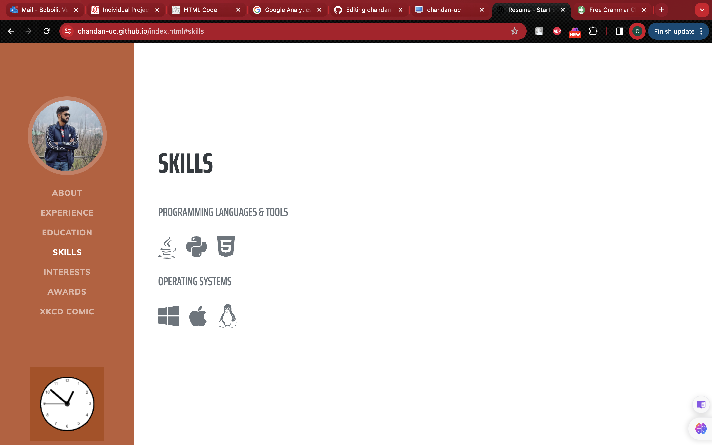
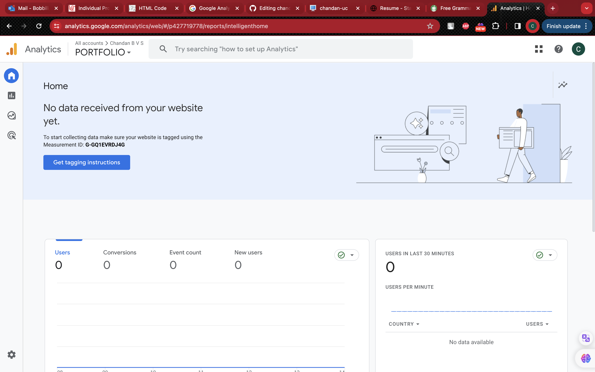
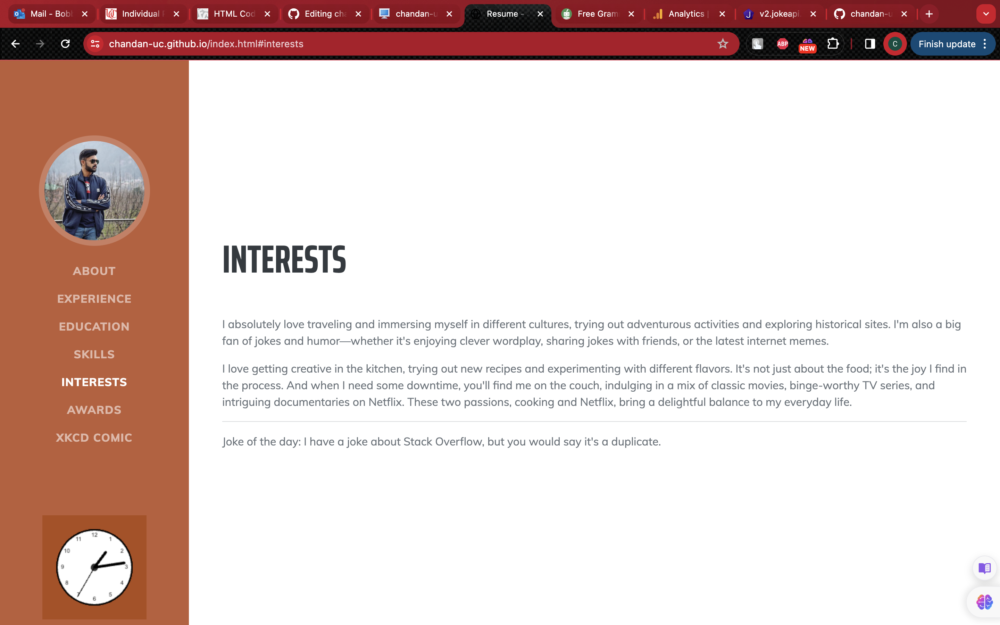
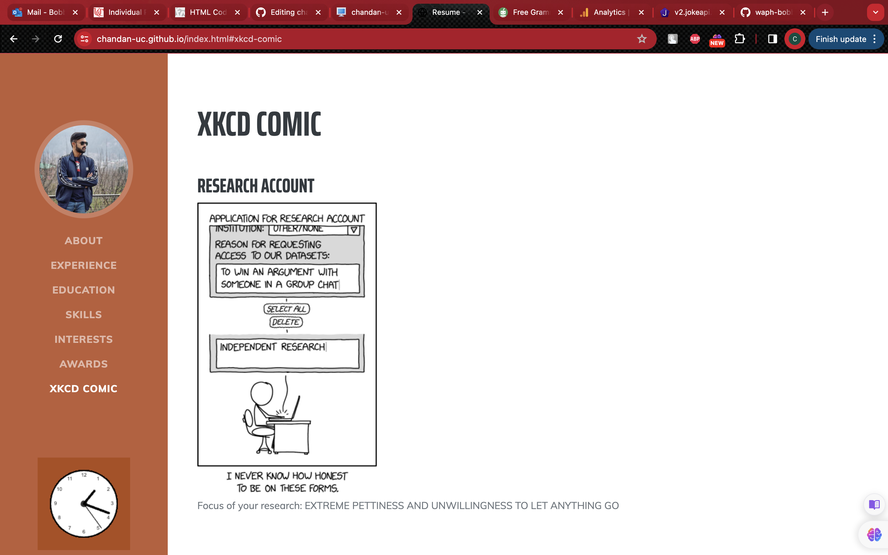

# WAPH-Web Application Programming and Hacking

## Instructor: Dr. Phu Phung

# Lab 1 - Foundations of the Web 

## STUDENT
**Name**: Venkata Sai Chandan Bobbili

**Email**: bobbilvn@mail.uc.edu


## Instructor: Dr. Phu Phung

# Individual Project 1 – Front-end Web Development with a Professional Profile Website on github.io cloud service

## Overview and Requirements 

I designed a webpage using HTML and JavaScript, incorporating features like interactive clocks and dynamic forms. Ajax facilitated server communication, and CSS provided styling, notably for buttons. jQuery streamlined Ajax requests, and the JokeAPI injected some response with AJAX GET request. The Agify API attempted age estimation, but real-time usage was restricted due to API limitations. In summary, the webpage integrated HTML, JavaScript, Ajax, CSS, and jQuery, offering an interactive and visually appealing experience.

Website URL: [https://chandan-uc.github.io/index.html](https://chandan-uc.github.io/index.html)

### General requirements

1. I designed a personal portfolio webpage that contains some information about me, my work experience, education, skills, interests, and certifications that I have achieved. I created a responsive HTML page using a navigation tag to display the different sections of my portfolio. When it is clicked on one section, it redirects to that section as mentioned in the screenshot.


2. For creating a link to a new HTML page to introduce this "Web Application Programming and Hacking" course and related hands-on projects I used a hyperlink tag with name "Click here to view Web Application Programming and Hacking course" which redirects to waph HTML file which has information regarding this courses lab, hackathons.


### Non-technical Requirements

1. For creating this portfolio website, I used Bootstrap and CSS for fonts. I used Awesome 5, which has different icons, font styles, etc. By implementing this CDN, I made my page more creative. For example, in the screenshot, you can view different icons.



2. For the next task to implement a page tracker, I used Google Analytics, where I created an account in analytics and gave some information about the page, and then Google gave the tag instruction with a specific id that should be initialized in the head tag of the html page, so whenever I open this page, it records it in the analytics report.

```javascript
<script async src="https://www.googletagmanager.com/gtag/js?id=G-GQ1EVRDJ4G"></script>
    <script>
        window.dataLayer = window.dataLayer || [];
        function gtag(){dataLayer.push(arguments);}
        gtag('js', new Date());
        gtag('config', 'G-GQ1EVRDJ4G');
    </script>
```


### Technical Reqirements

1. I implemented a digital clock in the about section and an analog clock in the navigation tag, where I used the same code that was used in the Lab 2 project. Similarly,  I implemented a show/hide email function using an email java script file, where this file is called in the main HTML page and shows "Show the email." When this is clicked, it displays the email.

```javascript
var shown = false;

function showhideEmail() {
    if (shown) {
        document.getElementById('email').innerHTML = "Show my email";
        shown = false;
    } else {
        var myemail = "<a href='mailto:bobbilvn" + "@" + "mail.uc.edu'>bobbilvn" + "@" + "mail.uc.edu</a>";
        document.getElementById('email').innerHTML = myemail;
        shown = true;
    }
}
```
2. For this subtask To integrate a joke API The jQuery library is used to fetch a joke from the JokeAPI every minute and display it on a webpage. It defines a function fetchJoke for fetching and displaying jokes, calls it initially, and sets up a timer to call it every minute. The jokes are retrieved asynchronously through AJAX requests, and the results are displayed in an HTML element with the ID response. This has been implemented in interest section of my portfolio page as mentioned in the screenshot

```javascript
<script type="text/javascript">
        // Function to fetch and display a joke
        function fetchJoke() {
            $.get("https://v2.jokeapi.dev/joke/Any?type=single", function (result) {
                console.log("From jokeAPI:" + JSON.stringify(result));
                if (result && result.joke) {
                    $("#response").text("Joke of the day: " + result.joke);
                } else {
                    $("#response").text("Couldn't retrieve a joke at this time.");
                }
            });
        }
    
        // Fetch initial joke
        fetchJoke();
    
        // Set interval to fetch a new joke every 1 minute
        setInterval(fetchJoke, 60000); // 60000 milliseconds = 1 minute
    </script>
```



3. To integrate another API this JavaScript code is designed to dynamically retrieve and display information about the latest XKCD comic on a web page. It utilizes a proxy to overcome Cross-Origin Resource Sharing (CORS) restrictions during development. The fetchXKCDComic() function is responsible for fetching data from the XKCD API, including the comic's title, image URL, and alt text. The obtained data is then used to update specific HTML elements on the page, namely the elements with the IDs "xkcd-title," "xkcd-img," and "xkcd-alt." This process is initiated automatically upon page load. Any potential errors during the data-fetching process are logged to the console. Overall, this script enhances the web page by dynamically incorporating the latest XKCD comic information. This is implemeted in a seperate section in my portfolio page name XKCD COMIC as shown in screenshot.

```javascript
<script>
        // Function to fetch XKCD comic data
        function fetchXKCDComic() {
            // Use the cors-anywhere proxy to bypass CORS issues during development
            const proxyUrl = "https://api.allorigins.win/raw?url=";
            const apiUrl = "https://xkcd.com/info.0.json";

            // Fetch data from XKCD API through the proxy
            fetch(proxyUrl + apiUrl)
                .then(response => response.json())
                .then(data => {
                    // Update the HTML elements with XKCD comic data
                    document.getElementById("xkcd-title").textContent = data.title;
                    document.getElementById("xkcd-img").src = data.img;
                    document.getElementById("xkcd-alt").textContent = data.alt;
                })
                .catch(error => {
                    console.error("Error fetching XKCD comic:", error);
                });
        }

        // Fetch XKCD comic on page load
        fetchXKCDComic();
    </script>
```


3. This subtask is to manage cookies and provide a personalized welcome message on a webpage. The setCookie function establishes a cookie with a specified name, value, and optional expiration time. The getCookie function retrieves a cookie's value by name from the user's device. The displayWelcomeMessage function determines whether it's the user's first visit or a return by checking the existence of a "lastVisit" cookie. For new visitors, it sets this cookie with the current date and displays a welcoming message. Returning visitors receive a welcome-back message along with the timestamp of their last visit. The script runs this logic on page load, ensuring a tailored greeting for users. To view the welcome message, include an HTML element with the ID "welcome-message" on the webpage. Overall, the script provides a user-friendly way to acknowledge and differentiate between first-time and returning visitors. There are 2 screenshots first one for first visit and second one is re-visit.

```javascript
<script type="text/javascript">
        // Function to set a cookie
        function setCookie(name, value, days) {
            var expires = "";
            if (days) {
                var date = new Date();
                date.setTime(date.getTime() + (days * 24 * 60 * 60 * 1000));
                expires = "; expires=" + date.toUTCString();
            }
            document.cookie = name + "=" + value + expires + "; path=/";
        }

        // Function to get a cookie value
        function getCookie(name) {
            var nameEQ = name + "=";
            var ca = document.cookie.split(';');
            for (var i = 0; i < ca.length; i++) {
                var c = ca[i];
                while (c.charAt(0) === ' ') c = c.substring(1, c.length);
                if (c.indexOf(nameEQ) === 0) return c.substring(nameEQ.length, c.length);
            }
            return null;
        }

        // Function to display welcome message based on cookie
        function displayWelcomeMessage() {
            var lastVisit = getCookie("lastVisit");

            if (!lastVisit) {
                // First time visit
                setCookie("lastVisit", new Date(), 365); // Store the current date for future visits
                document.getElementById("welcome-message").textContent = "Welcome to my homepage!";
            } else {
                // Returning visit
                document.getElementById("welcome-message").textContent = "Welcome back! Your last visit was " + lastVisit;
            }
        }

        // Display welcome message on page load
        displayWelcomeMessage();
    </script>
```


